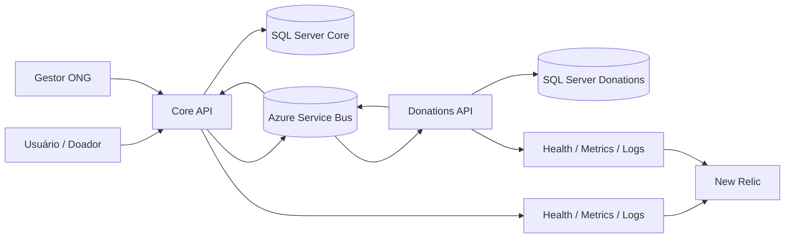
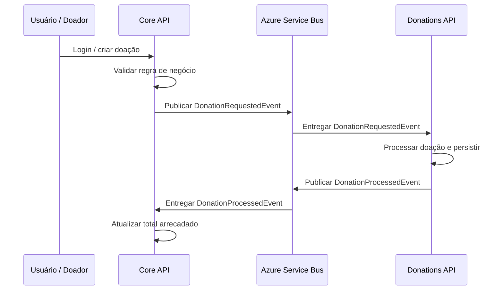
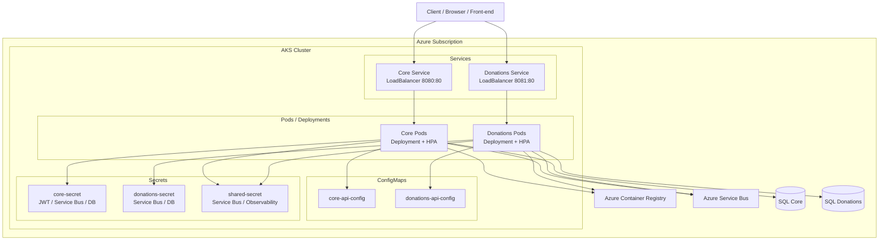

# Arquitetura Atual - Solidarity Connection

Este documento descreve a arquitetura atual dos dois repositórios do projeto: `fiap-solidarity-connection` e `fiap-solidarity-connection-donations`.

## Visão geral

O sistema está dividido em dois serviços principais:

- Core: autenticação, campanhas, solicitação de doação e consumo do evento de doação processada.
- Donations: consumo do evento de doação solicitada, processamento assíncrono e publicação do evento de processamento.

Os dois serviços se comunicam por Azure Service Bus e persistem dados em seus respectivos bancos SQL Server.

## Fluxo funcional

## Fluxo de requisição e processamento

## Visão de implantação no AKS

## Observações

- O Core não escreve no banco da Donations e a Donations não escreve no banco do Core.
- O Azure Service Bus é o ponto de integração assíncrona entre os dois serviços.
- O `health` de cada aplicação é usado para validação de subida local e monitoração básica.